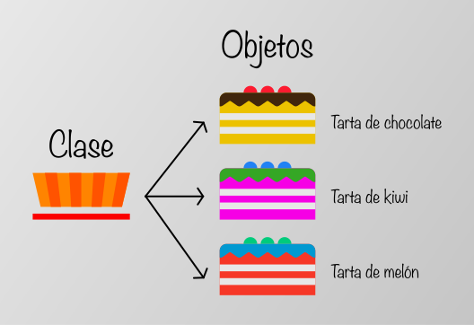
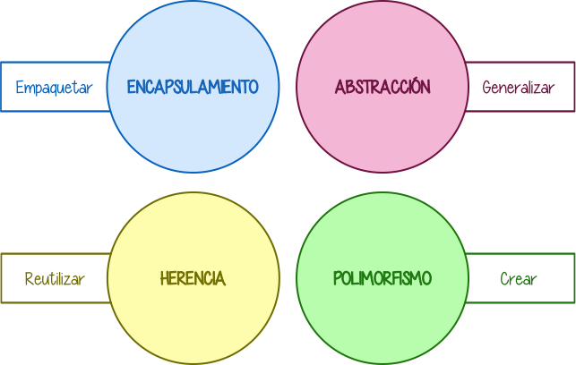

<link rel="stylesheet" href="assets/style.css">

# Carolina Martínez García, Checkpoint 6
---

# **¿Para qué usamos clases en Python?

Una clase en Python es una manera de organizar y estructurar el código, permitiendo crear objetos que comparten características y comportamientos similares.
Una clase es como una plantilla que define las características y los comportamientos que tendrán los objetos creados a partir de esa clase.



**Los elementos clave de la sintaxis de las clases son:**

- **class NombreDeLaClase:**, para implementar una nueva clase.
- **def \___init___(self, ...):**, esto es un constructor, una función especial que se ejecuta al crear un objeto.
- **self.atributo = valor**, para crear y almacenar atributos de instancia.
- **Funciones**, métodos dentro de la clase que operan sobre los atributos.
- **Instanciación**, crear un objeto de la clase, por ejemplo **objeto = NombreDeLaClase(...)**.

Por ejemplo, a continuación tenemos una clase con su función constructor y otra función para operar sobre los atributos:
```python
class Persona:
    def __init__(self, nombre, edad):
        self.nombre = nombre
        self.edad = edad

    def presentacion(self):
        print(f"Hola, soy {self.nombre} y tengo {self.edad} años.")

# Y ahora la instanciamos
persona1 = Persona("Marta", 25)
persona2 = Persona("Ana", 33)

# Llamamos al método de la clase
persona1.presentacion()
persona2.presentacion()

# Nos devolverá
Hola, soy Marta y tengo 25 años.
Hola, soy Ana y tengo 33 años.
```


Las clases en Python son fundamentales para la programación orientada a objetos, permiten la encapsulación de datos y funcionalidades, lo que facilita la modularidad y la reutilización del código.
Las clases contribuyen a la organización y estructuración de programas complejos, porque permiten aplicar el **paradigma de programación orientada a objetos (POO)**. Esto aporta varios beneficios:

## **1. La *encapsulación***

Las clases agrupan datos (atributos) y métodos (funciones) relacionados en una sola unidad. Esto evita la contaminación del espacio de nombres y facilita el mantenimiento del código. Por ejemplo:

```python
# Ejemplo sin clases
nombre = 'Juan'
edad = 30

def saludar():
    print(f'Hola, soy {nombre} y tengo {edad} años.')

# Ejemplo con clases
class Persona:
    def __init__(self, nombre, edad):
        self.nombre = nombre
        self.edad = edad
    
    def saludar(self):
        print(f'Hola, soy {self.nombre} y tengo {self.edad} años.')

# Aquí, cada instancia de la clase Persona tiene sus propios datos y comportamientos
```

## **2. Reutilización del Código, *Herencia***

Podemos crear clases basadas en otras, así evitamos la duplicar del código y una más fácil lectura del mismo.

Veamos un ejemplo de una clase padre con dos clases hija:

```python
class Animal:
    def __init__(self, nombre):
        self.nombre = nombre
    
    def sonido(self):
        pass

class Perro(Animal):
    def sonido(self):
        return f"{self.nombre} dice: ¡Guau!"

class Gato(Animal):
    def sonido(self):
        return f"{self.nombre} dice: ¡Miau!"

mi_perro = Perro("Txuski")
mi_gato = Gato("Garfield")

print(mi_perro.sonido())
print(mi_gato.sonido())

#Esto devolvería:

Txuski dice: ¡Guau!
Garfield dice: ¡Miau!
```
En este ejemplo, la clase padre, **Animal**, tiene un constructor (\___init___\), que define el nombre del animal y un método, **sonido()**, el cual será sobreescrito en las clases hijas (Perro y Gato), por la función **pass**.
Las clases hijas **heredan** de **Animal** y sobreescriben la función **sonido()** para darle su propio comportamiento.
Para instanciarla, se crean los objetos Perro y Gato, y al llamar a **sonido()**, cada uno usará su implementación específica.

## **3. Modularidad y Mantenibilidad**

Las clases dividen el código en componentes independientes y reutilizables, facilitando la depuración y la modificación.

Sin clases, la lógica estaría dispersa, lo que haría que el código fuera difícil de entender y también de mantener. Con las clases, cada entidad tiene su propio módulo bien definido.

Veámoslo con un ejemplo:
```python
class Empleado:
    def __init__(self, nombre, salario):
        self.nombre = nombre
        self.salario = salario

    def mostrar_info(self):
        return f"Empleado: {self.nombre}, salario: {self.salario}€"

# Así podemos reutilizar esta clase en distintos módulos sin tener que repetir código

empleado1 = Empleado("Marta", 80000)
print(empleado1.mostrar_info())

# Lo que nos devolvería

Empleado: Marta, salario: 80000€
```

## **4. Abstracción

La abstracción significa ocultar detalles, hacer atributos privados, para evitar que haya modificaciones que no queremos y asegurando así la integridad de los datos, exponiendo sólo lo necesario.

Esto se logra usando clases abstractas. Por ejemplo:
```python
class CuentaBancaria:
    def __init__(self, saldo):
        self.__saldo = saldo
    
    @property
    def saldo(self):
        return self.__saldo

cuenta = CuentaBancaria(100)
print(cuenta.saldo)

# Nos devolvería
100
```
En este ejemplo, hemos creado una clase donde tenemos un atributo privado, cuya sintaxis es poniendo dos guiones bajos al principio de la palabra. Luego hemos utilizado un **decorador de propiedades**, **@property**, y con esto solucionamos el problema de que todos tengan acceso a los datos. Con **@property** puedes acceder a los atributos de una forma más natural y mantener la flexibilidad si decides agregar lógica extra posteriormente.

Para saber más sobre **decoradores de Python**, lee el tutorial que hay en este [enlace](https://r.search.yahoo.com/_ylt=AwrLBlA94.9nGgIAT3VU04lQ;_ylu=Y29sbwNpcjIEcG9zAzQEdnRpZAMEc2VjA3Ny/RV=2/RE=1744984126/RO=10/RU=https%3a%2f%2fwww.datacamp.com%2fes%2ftutorial%2fdecorators-python/RK=2/RS=UUnP3iSqNqCAT0AjySF5L00YTIs-)

## **5. Polimorfismo

El polimorfismo permite que diferentes clases usen el mismo método con distintas implementaciones. Por ejemplo:
```python
class Animal:
    def sonido(self):
        pass

class Perro(Animal):
    def sonido(self):
        return "¡Guau!"

class Gato(Animal):
    def sonido(self):
        return "¡Miau!

animales = [Perro(), Gato()]
for animal in animales:
    print(animal.sonido())

# Lo que nos devolvería
¡Guau!
¡Miau!
```
En este ejemplo, se usa la misma interfaz (sonido()), pero cada clase lo implementa a su manera.



Las clases en Python estructuran programas complejos al hacerlos más organizados, reutilizables y fáciles de mantener. Gracias a la encapsulación, herencia, abstracción y polimorfismo, permiten escribir un código más limpio y escalable.

---
---
# **¿Qué método se ejecuta automáticamente cuando se crea una instancia de una clase?**

El método que se ejecuta automáticamente cuando se crea una instancia de una clase es el constructor **\___init___**.

Sirve para inicializar valores de ciertas variables, es decir, los de los atributos, por lo que de este modo siempre tendrás una serie de valores asignados por defecto al instanciar un objeto.

Su sintaxis es 
```def __init__(self, ...)```

Tiene las siguientes características:

- Es el primer método que se ejecuta cuando se crea un objeto.
- El método \___init___ se llama automáticamente al crear un objeto, es imposible olvidarse de llamarlo ya que se llamará automáticamente.
- Permite inicializar atributos sin necesidad de hacerlo manualmente después.
- Utiliza ***self*** para referirse a la instancia actual de la clase.
- Puede recibir parámetros para personalizar el objeto desde su creación.
- Es un método opcional, pero es muy común utilizarlo.

### **¿Qué es *self* en Python?**

El **self** de Python hace referencia al nombre del objeto en que se encuentra escrito. 

Se usa dentro de los métodos de la clase para acceder a los atributos y otros métodos de la instancia.

Es un **primer parámetro obligatorio** en los métodos de instancia como \___init___

Permite que cada objeto tenga sus propios valores de atributos.

Se podría reemplazar por el nombre de la clase. Pero esto no se considera una buena práctica, además de que no es tan fácil de leer.


## Ejemplo básico del constructor \___init___

```python
class Perro:
    def __init__(self, nombre):
        self.nombre = nombre

    def ladrar(self):
        print(f"{self.nombre} está ladrando")

perro1 = Perro("Rex")
perro1.ladrar()

# Nos devolverá
Rex está ladrando
```

## Ejemplo con más atributos y más funciones

```python
class CuentaBancaria:
    def __init__(self, titular, saldo):
        self.titular = titular
        self.saldo = saldo

    def depositar(self, cantidad):
        self.saldo += cantidad
        print(f"{cantidad} € han sido ingresados en la cuenta de {self.titular}.")

    def retirar(self, cantidad):
        if cantidad > self.saldo:
            print("Saldo insuficiente")
        else:
            self.saldo -= cantidad
            print(f"{cantidad} € han sido retirados de la cuenta de {self.titular}.")

    def obtener_saldo(self):
        return self.saldo

# Crear una cuenta bancaria
cuenta = CuentaBancaria("Carmen", 2000)
print(f"Titular: {cuenta.titular}" ", " f"Saldo: {cuenta.obtener_saldo()} €")
# Nos devolvería
Titular: Carmen, Saldo: 2000 €

# Ahora usamos métodos de la clase, para depositar dinero y que lo sume, y retirar dinero y que lo reste
cuenta1.depositar(500)
cuenta1.retirar(100)

print(f"Saldo actual: {cuenta.obtener_saldo()} €")

# Así nos devolvería
Titular: Carmen, Saldo 2000 €
500 € han sido ingresados en la cuenta de Carmen
100 € han sido retirados de la cuenta de Carmen
Saldo actual: 2400 €
```

## Errores más comunes al usar el constructor \___init___\

1. Olvidar poner *self* en los atributos. No podemos poner, porque no se almacenaría correctamente, el siguiente código:
```python
class Persona:
    def __init__(self, nombre, edad):
        nombre = nombre
        edad = edad

# lo correcto sería
class Persona:
    def __init__(self, nombre, edad):
        self.nombre = nombre
        self.edad = edad
```

2. No pasar los argumentos esperados al llamar a la función, por ejemplo:
```python
class Persona:
    def __init__(self, nombre, edad):
        self.nombre = nombre
        self.edad = edad

persona = Persona() # Se requieren 'nombre' y 'edad'
persona1 = Persona("Jose", 20) # Correcto
```

---
---

# **¿Cuáles son los tres verbos de API?**

Los tres verbos principales de una API suelen referirse a las operaciones básicas que se realizan sobre los datos. En el contexto de las API REST, estos verbos son:

1. **GET**, se usa para obtener información de un recurso. Una de sus principales características es la **idempotencia**, cuando una acción ejecutada un número indefinido de veces, produce siempre el mismo resultado. Una petición GET no debe causar efectos secundarios en el servidor, ni producir nuevos registros, ni modificar los ya existentes.

2. **POST**, Se usa para crear un nuevo recurso, cada llamada con POST debería producir un nuevo recurso. POST se dirige a un recurso que representa una colección, para indicar que el nuevo recurso debe agregarse a la misma.

3. **DELETE**, se usa para eliminar un recurso. Puede usarse para eliminar un recurso individual o para eliminar una colección completa.

A estos tres verbos se les pueden sumar otros como **PUT**, para actualizar un recurso de manera completa, y **PATCH**, para actualizar parcialmente un recurso.

Vamos a ver un ejemplo de una API REST en Python con Flask, implementando los métodos GET, POST, PUT, PATCH y DELETE para manejar usuarios.

Una API REST es una interfaz de comunicación entre sistemas de información que usa el protocolo de transferencia de hipertexto (hypertext transfer protocol o HTTP), para obtener datos o ejecutar operaciones sobre dichos datos en diversos formatos, como pueden ser XML o JSON.

Flask es un microframework de Python para desarrollar aplicaciones web. Es ligero, flexible y fácil de usar, ideal para crear APIs y aplicaciones web rápidas sin la complejidad de frameworks más grandes.

No impone estructuras rígidas, sólo lo esencial para comenzar, puedes agregar extensiones para bases de datos, autenticación, etc, es muy simple porque usa rutas y vistas de manera intuitiva, y permite renderizar HTML dinámico.

```python
from flask import Flask, request, jsonify

app = Flask(__name__)

# Base de datos simulada (lista de diccionarios)
usuarios = [
    {"id": 1, "nombre": "Juan Pérez", "email": "juan@example.com"},
    {"id": 2, "nombre": "María López", "email": "maria@example.com"}
]

# Función para encontrar usuario por ID
def buscar_usuario(id):
    return next((user for user in usuarios if user["id"] == id), None)

# GET - Obtener todos los usuarios
@app.route('/usuarios', methods=['GET'])
def obtener_usuarios():
    return jsonify(usuarios)

# GET - Obtener un usuario por ID
@app.route('/usuarios/<int:id>', methods=['GET'])
def obtener_usuario(id):
    usuario = buscar_usuario(id)
    return jsonify(usuario) if usuario else ("Usuario no encontrado", 404)

# POST - Crear un nuevo usuario
@app.route('/usuarios', methods=['POST'])
def crear_usuario():
    datos = request.json
    nuevo_usuario = {
        "id": len(usuarios) + 1,  # Simulación de autoincremento
        "nombre": datos["nombre"],
        "email": datos["email"]
    }
    usuarios.append(nuevo_usuario)
    return jsonify(nuevo_usuario), 201

# PUT - Actualizar un usuario completamente
@app.route('/usuarios/<int:id>', methods=['PUT'])
def actualizar_usuario(id):
    usuario = buscar_usuario(id)
    if not usuario:
        return ("Usuario no encontrado", 404)
    
    datos = request.json
    usuario["nombre"] = datos["nombre"]
    usuario["email"] = datos["email"]
    
    return jsonify(usuario)

# PATCH - Actualizar parcialmente un usuario
@app.route('/usuarios/<int:id>', methods=['PATCH'])
def actualizar_parcial_usuario(id):
    usuario = buscar_usuario(id)
    if not usuario:
        return ("Usuario no encontrado", 404)

    datos = request.json
    usuario.update({k: v for k, v in datos.items() if v is not None})

    return jsonify(usuario)

# DELETE - Eliminar un usuario
@app.route('/usuarios/<int:id>', methods=['DELETE'])
def eliminar_usuario(id):
    usuario = buscar_usuario(id)
    if not usuario:
        return ("Usuario no encontrado", 404)

    usuarios.remove(usuario)
    return ("", 204)

# Iniciar el servidor Flask
if __name__ == '__main__':
    app.run(debug=True)
```

## **Cómo probar la API**

Tendremos que ejecutar el código y usar POSTMAN para probar los endpoints:

Si queremos obtener todos los usuarios:
```postman
GET /localhost:5000/usuarios
```
Si queremos obtener un usuario específico, por ejemplo el usuario con ID 3
```postman
GET /localhost:5000/usuarios/3
```
Si queremos crear un nuevo usuario
```POSTMAN
POST /localhost:5000/usuarios
```
Y seleccionando **Body**, **raw** y **JSON**, pondríamos en el contenido:
```json
{
    "nombre": "Carlos Ramírez",
    "email": "carlos@example.com"
}
```
Si queremos eliminar un usuario, por ejemplo el usuario con ID 1:
```POSTMAN
DELETE /localhost:5000/usuarios/1
```

El dato **localhost:5000** lo sabremos porque en nuesto código hemos puesto **app.run(debug=True)**. Flask, al ejecutarse este código, inicia un servidor web en tu ordenador y, por defecto, lo levanta en http://127.0.0.1:5000/, o lo que también puedes escribir como localhost:5000.

La función **request** es una función de Flask que nos permite acceder a los datos enviados por el usuario en una petición HTTP.

La función **jsonify** también es una función de Flask, y esta permite convertir un diccionario de Python en una respuesta JSON válida, que es el formato estándar en APIs REST.

Puedes buscar más información pinchando [aquí](https://r.search.yahoo.com/_ylt=AwrkEKNy2.5nCgIA.IBU04lQ;_ylu=Y29sbwNpcjIEcG9zAzIEdnRpZAMEc2VjA3Ny/RV=2/RE=1744916594/RO=10/RU=https%3a%2f%2fwww.codigofacilito.com%2farticulos%2frails-verbos-http/RK=2/RS=nKYLi4jNMm5EVCf7W.iOs0WTTeQ-)

---
---
# **¿Es MongoDB una base de datos SQL o NoSQL?**

### ¿Qué es una base de datos SQL?

Una base de datos SQL (Structured Query Language), es relacional, almacena la información en tablas organizadas con filas y columnas. Sus características principales son:
- Estuctura fija: usa esquemas definidos con tablas y relaciones entre ellas.
- Integridad y consistencia: asegura que los datos sean precisos con reglas estrictas.
- Lenguaje SQL estándar: se usa para consultar y manipular los datos (SELECT, INSERT, UPDATE, DELETE).
- Escalabilidad vertical: se mejora el rendimiento con mejores servidores.

Ejemplo de una consulta SQL:
```sql
SELECT nombre, edad FROM usuarios WHERE edad > 25;
```

### ¿Qué es una base de datos NoSQL?

Una base de datos NoSQL, no relacional, almacena los datos en formatos flexibles, como documentos JSON, gráficos o pares clave-valor. No usa equemas rígidos y está diseñada para manejar grandes volúmenes de datos con alto rendimiento. Sus características principales son:
- Flexible, no requiere estructuras fijas de datos.
- Escalabilidad horizontal, se puede distribuir en múltiples servidores fácilmente.
- Alto rendimiento, maneja grandes volúmenes de datos rápidamente.
- Diferentes modelos de datos, como documentos, clave-valor, gráficos y columnas anchas.

Ejemplo de documento en MongoDB (NoSQL):
```json
{
    "nombre": "Ana Ruiz",
    "edad": 23,
    "email": "anaruiz@ejemplo.com"
}
```

**Consejos:**

Usa SQL si necesitas transacciones seguras y relaciones complejas entre datos.

Usa NoSQL si manejas datos grandes, sin estructura fija y necesitas rapidez.

### **MongoDB**

**MongoDB** es una base de datos **NoSQL** que almacena datos en formato JSON en lugar de tablas como en las bases de datos relacionales (SQL). Es ideal para manejar grandes volumenes de datos y estructuras flexibles.

Sus características principales son:
- Es una base de datos **NoSQL**, no usa tablas ni esquemas rígidos, los datos se guardan en documentos JSON.
- **Escalabilidad**, puede manejar grandes volúmenes de datos de forma distribuida.
- **Flexible**, no requiere estructura fija en los documentos.
- **Alto rendimiento**, optimizado para lecturas y escrituras rápidas.
- **Consultas poderosas**, soporta consultas avanzadas con filtros y agregaciones.

### Ejemplo de cómo conectar MongoDB con Python usando Flask:

Primero, en nuestra terminal, instalaremos **pymongo** con la orden
```bash
pip install pymongo
```
Después conectamos Flask con MongoDB, vamos a ver el código completo:
```python
from flask import Flask, jsonify
from pymongo import MongoClient

app = Flask(__name__)
client = MongoClient("mongodb://localhost:27017/")  # Conectar a MongoDB
db = client["mi_base_de_datos"]  # Crear/usar base de datos
coleccion = db["usuarios"]  # Crear/usar colección

@app.route('/usuarios')
def obtener_usuarios():
    usuarios = list(coleccion.find({}, {"_id": 0}))  # Obtener todos los usuarios
    return jsonify(usuarios)

if __name__ == '__main__':
    app.run(debug=True)
```
Al ejecutar este código, cuando accedamos a **http://127.0.0.1:5000/usuarios**, veremos la lista de usuarios almacenados en **MongoDB**.

Puedes buscar más información sobre MongoDB pinchando [aquí](https://r.search.yahoo.com/_ylt=AwrLNigY8u5ngwIAFfpU04lQ;_ylu=Y29sbwNpcjIEcG9zAzEEdnRpZAMEc2VjA3Ny/RV=2/RE=1744922393/RO=10/RU=https%3a%2f%2fwww.mongodb.com%2fes%2fresources%2fbasics%2fdatabases%2fnosql-explained%2fnosql-vs-sql/RK=2/RS=r8Oojf4R9cEs_em3vMUwnA2DrvI-)

---
---
# **¿Qué es una API?

Una API, es una **i**nterfaz de **p**rogramación de **a**plicaciones, un conjunto de reglas o protocolos que permite a las aplicaciones informáticas comunicarse entre sí para intercambiar datos, características y funcionalidades.

- Simplifican y aceleran el desarrollo de aplicaciones y sofware, ya que permite a los desarrolladores integrar datos, servicios y capacidades de otras aplicaciones, en lugar de desarrollarlas desde cero.

- Ofrecen a los propietarios de las aplicaciones una forma sencilla y segura de poner los datos y las funciones de sus aplicaciones a disposición de los departamentos de su organización. A su vez pueden compartir o comercializar datos y funciones con socios comerciales o terceros.

- Las API permiten compartir sólo la información necesaria, ocultando otros detalles internos del sistema, lo que ayuda a la seguridad del sistema.

- La documentación de la API es como un manual de instrucciones técnicas que proporciona detalles sobre una API e información para los desarrolladores sobre cómo trabajar con una API y sus servicios.

## ¿Cómo funciona una API?

Si pensamos en la comunicación de la API en términos de una solicitud y respuesta entre un cliente y un servidor, es muy fácil entender su funcionamiento. La aplicación que envía su solicitud sería el cliente y el servidor proporciona la respuesta. La API es el puente que establece conexión entre ellos.

Una manera sencilla de entender cómo funcionana las API es con el ejemplo de un proceso de pagos a terceros. 

Imaginemos que estamos haciendo una compra online y es posible que pida una autorización a través de tu banco para poder pagar. Esta función depende de las API para realizar la conexión.

- Cuando compras y haces clic en el botón de pago, se envía una llamada a la API para recuperar la información. Esta solicitud se procesa desde una aplicación al servidor web a través del identificador uniforme de recursos (URI) de la API e incluye un verbo de solicitud, una cabecera y, a veces, un cuerpo de solicitud.

- Tras recibir una solicitud válida desde la página web del producto, la API llama al programa externo o al servidor web, en este caso, de tu banco.

- El servidor envía una respuesta a la API con la información solicitada.

- La API transfiere los datos a la aplicación solicitante inicial, en este caso, la página donde estás haciendo la compra.

## Tipos de API

Las API se pueden clasificar por casos de uso:

- **API de datos (o bases de datos)**, que se utilizan para conectar aplicaciones y sistemas de gestión de bases de datos.
- **API del sistema operativo (local)**, que se usa para definir cómo las aplicaciones usan los servicios y recursos del sistema operativo.
- **API remotas**, se utilizan para definir cómo interactúan las aplicaciones en diferentes dispositivos.
- **API web**, utilizadas para permitir la transferencia de datos y funcionalidades a través de internet mediante el protocolo HTTP.

Hoy en día, la mayoría de las API son API web. Las API web son un tipo de API remota (lo que significa que la API utiliza protocolos para manipular recursos externos) que exponen los datos y la funcionalidad de una aplicación a través de internet.

### Los cuatro tipos principales de API son:

1. **API abiertas**

    Son interfaces de programación de aplicaciones de código abierto que se puede acceder con el protocolo HTTP. También conocidas como API públicas, han definido endpoints de API y formatos de solicitud y respuesta.

2. **API de socios**

    Las API de socios conectan a socios comerciales estratégicos. Los programadores acceden a estas API normalmente en modo de autoservicio a través de un portal público para programadores de API. Aun así deben completar un proceso de incorporación y obtener credenciales de inicio de sesión para acceder a las API de socios.

3. **API internas**

    Son privadas, permanecen ocultas para usuarios externos. No están disponibles para usuarios fuera de la empresa. En cambio, los organizadores las utilizan para mejorar la productividad y la comunicación entre diferentes equipos de desarrollo internos.

4. **API compuestas**

    Combinan múltiples API de datos o servicios. Permiten a los programadores acceder a varios endpoints en una sola llamada. Son útiles en la arquitectura de microservicios, donde la realización de una única tarea puede requerir información de varias fuentes.

### Ejemplos de API

#### **_Inicios de sesión universales_**

Un ejemplo popular de API es la función que permite a los usuarios iniciar sesión en un sitio web utilizando los datos de acceso de su perfil de Facebool, X, o Google. Esta práctica función permite a cualquier sitio web utilizar una API de uno de los servicios más populares para una autenticación rápida. Esta función ayuda a los usuarios a ahorrarse el tiempo y la molestia de configurar un nuevo perfil para cada aplicación web o nueva afiliación.

#### **_Internet de las cosas (IoT)_**

Estos "dispositivos inteligentes" ofrecen funciones adicionales, como pantallas táctiles habilitadas para Internet y recopilación de datos, a través de API. Por ejemplo, un frigorífico inteligente puede conectarse a aplicaciones de recetas o tomar y enviar notas a través de mensajes de texto. Las cámaras internas se conectan a varias aplicaciones para que los usuarios puedan ver el contenido de la nevera desde cualquier lugar.

#### **_Comparaciones de reservas de viajes_**

Los sitios web de reservas de viajes reúnen miles de vuelos y muestran las opciones más baratas para cada fecha y destino. Las API habilitan este servicio al proporcionar a los usuarios de la aplicación acceso a la información más reciente sobre la disponibilidad de hoteles y aerolíneas.

Este acceso está disponible a través de un navegador web o de la propia aplicación de la empresa de reservas de viajes. Con un intercambio autónomo de datos y solicitudes, las API reducen drásticamente el tiempo y el esfuerzo que supone buscar vuelos o alojamientos disponibles.

#### **_Aplicaciones de navegación_**

Las aplicaciones de navegación utilizan API principales que muestran mapas estáticos o interactivos. Estas aplicaciones también utilizan otras API y funciones para proporcionar a los usuarios indicaciones, límites de velocidad, puntos de interés, advertencias de tráfico y más. Los usuarios se comunican con una API cuando trazan rutas de viaje o rastrean artículos en movimiento, como un vehículo de reparto.

#### **_Aplicaciones SaaS_**

Las API son una parte integral del crecimiento de los productos software como servicio (SaaS). Las plataformas como los CRM (herramientas de gestión de relaciones con los clientes) suelen incluir una serie de API integradas que permiten a las empresas integrarse con aplicaciones que ya utilizan, como aplicaciones de mensajería, redes sociales y correo electrónico.

Esta integración reduce drásticamente el tiempo dedicado a cambiar entre aplicaciones para tareas de ventas y marketing. También ayuda a reducir o evitar los silos de datos que puedan existir entre departamentos que utilizan diferentes aplicaciones.

Averigua más sobre las API accediendo al siguiente enlace (https://mailchimp.com/es/resources/what-is-an-api-endpoint/)

---
---
# **¿Qué es Postman?**

Postman es una plataforma diseñada específicamente para probar y gestionar APIs, permitiendo a los desarrolladores simplificar cada paso del ciclo de vida de una API.

Fue creado originalmente como una extensión del navegador, pero hoy en día Postman se encuentra disponible como **aplicación** independiente para Windows, Linux y macOS.

Los desarrolladores pueden enviar peticiones HTTP (GET, POST, DELETE, PUT, PATCH, entre otros), realizar pruebas automatizadas, y generar documentación detallada para las APIs, todo desde una iterfaz gráfica amigable. Con esta herramienta **ahorran tiempo** y también **reducen errores en la programación** de aplicaciones que requieren comunicación constante con servicios externos.

## Características de Postman

- **Colección de solicitudes**: Postman permite agrupar diferentes solicitudes en colecciones, lo cual facilita la organización de las pruebas y la reutilización de peticiones en distintos entornos de desarrollo.

- **Pruebas automatizadas**: Utilizando *JavaScript*, Postman permite la creación de scripts personalizados para automaizar pruebas y validar respuestas. Esto es esencial para garantizar que los servicios web funciones correctamente en diferentes etapas del ciclo de desarrollo.

- **Gestión de entornos**: Postman permite crear y gestionar distintos entornos (desarrollo, pruebas, producción) para probar cómno se comportan las APIs en diferentes configuraciones. Esto proporciona una gran flexibilidad a la hora de realizar pruebas sin necesidad de cambiar manualmente los parámetros.

- **Generación de documentación**: La documentación es fundamental para que otros desarrolladores comprendan cómo interactuar con una API. Postman genera automáticamente documentación a partir de las solicitudes y las respuestas, haciendo que sea más sencillo compartir los detalles de la API con el equipo.

## Ventajas de usar Postman

1. **Interfaz gráfica intuitiva**: Postman ofrece una interfaz amigable y fácil de usar, que permite a los desarrolladores ejecutar pruebas sin necesidad de escribir código complejo. La posibilidad de interactuar de manera visual con las APIs reduce significativamente la curva de aprendizaje y favorece la productividad.

2. **Compatibilidad multiplataforma**: Postman es compatible con diversos sistemas operativos y puede ejecutarse en cualquier lugar, lo cual permite a los desarrolladores trabajar de manera colaborativa y sin restricciones. Además, su capacidad para soportar múltiples protocolos, como HTTP, HTTPS, y GraphQL, lo convierte en una herramienta versátil.

3. **Mejora en la colaboración**: Postman fomenta la colaboración en los equipos de desarrollo al permitir compartir colecciones de solicitudes y entornos. Esto facilita la integración de todos los miembros del equipo y asegura que todos trabajen sobre la misma base, mejorando la coordinación.

4. **Versión gratuita**: Postman ofrece un plan gratuito con características suficientes para equipos pequeños y proyectos individuales. Aunque también tiene una versión premium, la opción gratuita sigue siendo muy potente para los desarrolladores que comienzan a trabajar con APIs.

5. **Automatización y productividad**: Postman permite automatizar tareas repetitivas, como la ejecución de pruebas o la generación de documentación, lo cual incrementa la productividad del equipo. Los desarrolladores pueden enfocarse en resolver problemas más complejos y mejorar la calidad del software.

## ¿Para qué sirve Postman?

Postman permite a los usuarios **interactuar de manera eficiente** con APIs, realizar pruebas exaustivas y colaborar con otros desarrolladores.

### Desarrollo y prueba de APIs

La herramienta permite enviar solicitudes HTTP a servicios web y analizar sus respuestas, lo que es esencial para verificar el correcto funcionamiento de los endpoints. Los desarrolladores pueden utilizar Postman para enviar solicitudes GET, POST, PUT, DELETE, entre otros métodos, y comprobar cómo responde la API en diferentes circunstancias. 

Ayuda a identificar **errores** y también permite **validar las funciones** que se han implementado. Por ejemplo, si estamos construyendo un servicio web, Postman puede utilizarse para verificar si la API devuelve los datos correctos cuando se le proporcionan entradas específicas.

### Automatización de pruebas

Los desarrolladores pueden escribir scripts de prueba utilizando JavaScript para automatizar la validación de las respuestas recibidas. Esto es particularmente útil para realizar **pruebas de regresión**, asegurandonos que las nuevas funcionalidades no afectan negativamente el comportamiento existente de la API.

### Documentación de APIs

Postman también es una herramienta eficaz para documentar APIs. La documentación generada por Postman incluye detalles de las solicitudes realizadas, ejemplos de respuestas y descripciones de los endpoints. Esta documentación interactiva es muy útil y facilita la comprensión del funcionamiento de la API a otros desarrolladores del proyecto.

Esta documentación puede compartirse online, permitiendo que cualquier miembro del equipo acceda a ella. También se pueden crear **colecciones** que nos servirán de guía sobre cómo utilizar la API.

### Colaboración con equipos de desarrollo

Con Postman los equipos que trabajan en proyectos grandes y distribuidos pueden compartir colecciones de solicitudes, entornos de pruebas y los resultados obtenidos. Esta funcionalidad ayuda a que todos los miembros del equipo trabajen de manera coordinada y eficiente, evitando errores y asegurando que todos estén alineados respecto al comportamiento y evolución de la API.

Postman también ofrece opciones de sincronización en la nube, permitiendo a los desarrolladores acceder a sus colecciones desde cualquier lugar y dispositivo.

### Pruebas de integración continua

Las pruebas automatizadas de APIs pueden integrarse con herramientas de CI/CD para verificar cada cambio realizado en el software, lo cual asegura que el nuevo código no afecte negativamente al funcionamiento del sistema. Gracias a las integraciones de Postman con herramientas populares de automatización, los equipos pueden implementar un flujo de trabajo que permita la prueba continua y el despliegue ágil del software.

**Postman es, sin duda, una herramienta esencial para cualquier equipo de desarrollo** que busque mejorar la calidad del software, facilitar la colaboración y reducir el tiempo de entrega al cliente. Al combinar sus capacidades de prueba, automatización, documentación y colaboración, Postman se convierte en un aliado clave en el desarrollo de servicios web robustos y fiables.

Si quieres aprender a usar Postman, aquí tienes un enlace para inscribirte a un [curso completo de Postman](https://imaginaformacion.com/cursos/postman)

---
---
# **¿Qué es el polimorfismo?**

El **polimorfismo** es uno de los pilares básicos en la programación orientada a objetos (POO).

El término polimorfismo tiene origen en las palabras poly (muchos) y morfo (formas), y aplicado a la programación hace referencia a que una misma interfaz (o método) se comporte de diferentes formas dependiendo del tipo de objeto que la utilice.

En Python no es imprescindible que los objetos compartan un interfaz, simplemente basta con que tengan los métodos que se quieren llamar.

Vamos a ver un ejemplo paso a paso:

Supongamos que tenemos un clase **Animal** con un método **hablar()**.
```python
class Animal:
    def hablar(self):
        pass
```
Por otro lado tenemos otras dos clases, **Perro**, **Gato** que ***heredan*** de la anterior. Además, implementan el método hablar() de una forma distinta.
```python
class Perro(Animal):
    def hablar(self):
        print("Guau!")

class Gato(Animal):
    def hablar(self):
        print("Miau!")
```
A continuación creamos un objeto de cada clase y llamamos al método hablar(). Podemos observar que cada animal se comporta de manera distinta al usar hablar().
```python
for animal in Perro(), Gato():
    animal.hablar()

# Guau!
# Miau!
```
En el caso anterior, la variable animal ha ido “tomando las formas” de Perro y Gato. Sin embargo, date cuenta que al tener tipado dinámico este ejemplo hubiera funcionado igual sin que existiera herencia entre Perro y Gato, pero esta explicación la encontrarás si buscas información sobre [duck typing](https://r.search.yahoo.com/_ylt=AwrkgQUX2.9nBwIAlT5U04lQ;_ylu=Y29sbwNpcjIEcG9zAzcEdnRpZAMEc2VjA3Ny/RV=2/RE=1744982039/RO=10/RU=https%3a%2f%2fcodigonautas.com%2fque-es-duck-typing%2f/RK=2/RS=Fl3SrWhvIB5jtiFPKoci450amGc-)

## Tipos de polimorfismo

1. Polimorfismo en tiempo de compilación (o estático):

- También llamado sobrecarga de métodos (method overloading).
- Varios métodos con el mismo nombre, pero diferentes parámetros.

Ejemplo en Java:
```js
class Ejemplo {
    void saludar() {
        System.out.println("Hola");
    }

    void saludar(String nombre) {
        System.out.println("Hola " + nombre);
    }
}
```

2. Polimorfismo en tiempo de ejecución (o dinámico):

- También llamado sobreescritura de métodos (method overriding).
- Una subclase proporciona una implementación específica de un método definido en su superclase.

Ejemplo en Java:
```java
class Animal {
    void hacerSonido() {
        System.out.println("Algún sonido");
    }
}

class Perro extends Animal {
    void hacerSonido() {
        System.out.println("Guau");
    }
}

class Gato extends Animal {
    void hacerSonido() {
        System.out.println("Miau");
    }
}

// En uso:
Animal miAnimal = new Perro();
miAnimal.hacerSonido();  // Imprime: Guau
```
Aunque **miAnimal** es del tipo **Animal**, como realmente apunta a un **Perro**, se ejecuta el método de **Perro**.

### Ejemplo en Python con una **lista** de animales
```python
class Animal:
    def hacer_sonido(self):
        print("Este animal hace un sonido")

class Perro(Animal):
    def hacer_sonido(self):
        print("Guau")

class Gato(Animal):
    def hacer_sonido(self):
        print("Miau")

# Lista de animales
animales = [Perro(), Gato(), Animal()]

# Polimorfismo en acción
for animal in animales:
    animal.hacer_sonido()

## Nos devolverá
Guau
Miau
Este animal hace un sonido
```
En este ejemplo, aunque todos los objetos están en una misma lista y se tratan como instancias de Animal, cada uno ejecuta su propia versión del método hacer_sonido().

Eso es polimorfismo: un mismo método (hacer_sonido) se comporta de distintas formas según el tipo de objeto.

## ¿Para qué sirve el polimorfismo?

1. **Flexibilidad**: permite escribir código más genérico y reutilizable.

2. **Extensibilidad**: puedes agregar nuevas clases sin cambiar el código existente.

3. **Mantenibilidad**: facilita el mantenimiento al reducir duplicación.

---
---
# **¿Qué es un método dunder?

En Python, los métodos Dunder (abreviatura de “double underscore”) son aquellos cuyo nombre comienza y termina con dos guiones bajos (__).

Estos métodos no se llaman directamente, sino que son invocados automáticamente por el intérprete de Python en diversas situaciones (como operaciones aritméticas, manipulación de secuencias y gestión del contexto).

Método |	Descripción
--- | ---
__init__|	Inicializa una nueva instancia de una clase
__str__	|Devuelve una string de un objeto, amigable para el usuario
__repr__	|Devuelve una string de un objeto, amigable para el desarrollador
__len__	|Devuelve la longitud de un objeto
__getitem__|	Permite acceder a elementos mediante índices
__setitem__	|Permite asignar valores a elementos mediante índices
__delitem__|	Permite eliminar elementos mediante índices
__iter__	|Devuelve un iterador para el objeto
__next__	|Devuelve el siguiente elemento del iterador

Todos estos métodos recuerda que su sintaxis es con dos guiones bajos por delante y por detrás del mombre
```python
__init__
```

## Implementación de métodos Dunder

Veamos cómo se implementan y utilizan algunos de estos métodos en una clase en **Python**.

### Método \___init___

Se utiliza para inicializar los atributos de una clase cuando se crea una nueva instancia.
Ejemplo:
```python
class Persona:
    def __init__(self, nombre, edad):
        self.nombre = nombre
        self.edad = edad

persona1 = Persona("Alice", 30)
print(persona1.nombre)  # Salida: Alice
print(persona1.edad)    # Salida: 30
```

### Métodos \___str___ y \___repr___

Los métodos __str__ y __repr__ devuelven representaciones en cadena de un objeto. La diferencia principal es que __str__ está destinado a una representación amigable para el usuario, mientras que __repr__ está orientado a los desarrolladores y debe ser más detallado. Ejemplo:
```python
class Persona:
    def __init__(self, nombre, edad):
        self.nombre = nombre
        self.edad = edad
    
    def __str__(self):
        return f"Persona: {self.nombre}, {self.edad} años"
    
    def __repr__(self):
        return f"Persona('{self.nombre}', {self.edad})"

persona1 = Persona("Alice", 30)
print(str(persona1))  # Salida: Persona: Alice, 30 años
print(repr(persona1)) # Salida: Persona('Alice', 30)
```

### Método \___len___

Se utiliza para devolver la longitud de un objeto.
```python
class Grupo:
    def __init__(self, miembros):
        self.miembros = miembros
    
    def __len__(self):
        return len(self.miembros)

grupo = Grupo(["Alice", "Bob", "Charlie"])
print(len(grupo))  # Salida: 3
```

### Métodos \___getitem___, \___setitem___ y \___delitem___

Estos métodos permiten que los objetos de una clase se comporten como contenedores (listas, diccionarios, etc.).
```python
class MiLista:
    def __init__(self):
        self.data = []
    
    def __getitem__(self, index):
        return self.data[index]
    
    def __setitem__(self, index, value):
        self.data[index] = value
    
    def __delitem__(self, index):
        del self.data[index]

mi_lista = MiLista()
mi_lista.data = [1, 2, 3, 4, 5]
print(mi_lista[2])   # Salida: 3
mi_lista[2] = 30
print(mi_lista[2])   # Salida: 30
del mi_lista[2]
print(mi_lista.data) # Salida: [1, 2, 4, 5]
```

### Métodos \___iter___ y \___next___

Estos métodos permiten que los objetos de una clase sean iterables.
```python
class Contador:
    def __init__(self, max):
        self.max = max
        self.contador = 0
    
    def __iter__(self):
        return self
    
    def __next__(self):
        if self.contador < self.max:
            self.contador += 1
            return self.contador
        else:
            raise StopIteration

contador = Contador(5)
for numero in contador:
    print(numero)
```

## Métodos Dunder para operaciones aritméticas

Además de los métodos mencionados, Python permite sobrecargar operadores aritméticos usando métodos dunder como \___add___, \___sub___, \___mul___, \___truediv___, entre otros.
```python
class Vector:
    def __init__(self, x, y):
        self.x = x
        self.y = y
    
    def __add__(self, otro):
        return Vector(self.x + otro.x, self.y + otro.y)
    
    def __repr__(self):
        return f"Vector({self.x}, {self.y})"

v1 = Vector(2, 3)
v2 = Vector(4, 5)
v3 = v1 + v2
print(v3)  # Salida: Vector(6, 8)
```

Puedes ver más información sobre los métodos Dunder pinchando en este [enlace](https://r.search.yahoo.com/_ylt=Awr.QHm.3u9nfAIAbZhU04lQ;_ylu=Y29sbwNpcjIEcG9zAzIEdnRpZAMEc2VjA3Ny/RV=2/RE=1744982974/RO=10/RU=https%3a%2f%2fdiveintopython.org%2fes%2flearn%2fclasses%2fdunder-magic-methods/RK=2/RS=2rx1F0SgRfNaVwe8D9fqVWFBKsA-)

---
---
# **¿Qué es un decorador de python?

Los decoradores son funciones que modifican el comportamiento de otras funciones, ayudan a acortar nuestro código y hacen que sea más Pythonic. Si alguna vez has visto @, estás ante un decorador o decorator, bien sea uno que Python ofrece por defecto o uno que puede haber sido creado.

## Sintaxis básica

Veamos un ejemplo muy sencillo. Tenemos una función **suma()** que vamos a decorar usando **mi_decorador()**. Para ello, antes de la declaración de la función suma, hacemos uso de **@mi_decorador**.

```python
def mi_decorador(funcion):
    def nueva_funcion(a, b):
        print("Se va a llamar")
        c = funcion(a, b)
        print("Se ha llamado")
        return c
    return nueva_funcion

@mi_decorador
def suma(a, b):
    print("Entra en funcion suma")
    return a + b

suma(5,8)

# Se va a llamar
# Entra en funcion suma
# Se ha llamado
```
Lo que realiza mi_decorador() es definir una nueva función que encapsula o envuelve la función que se pasa como entrada. Concretamente lo que hace es hace uso de dos print(), uno antes y otro después de la llamada la función.

Por lo tanto, cualquier función que use @mi_decorador tendrá dos print, uno y al principio y otro al final, dando igual lo que realmente haga la función.

Veamos otro ejemplo usando el decorador sobre otra función.

```python
@mi_decorador
def resta(a ,b):
    print("Entra en funcion resta")
    return a - b

resta(5, 3)

# Se va a llamar
# Entra en funcion resta
# Se ha llamado
```

Un decorador en Python es una función que recibe otra función como argumento y devuelve una nueva función, generalmente para extender su comportamiento sin modificar su código original. Sus usos son:

- Añadir funcionalidad extra a una función o método (como logging, validación, control de acceso, etc.)
- Es una forma elegante y reutilizable de aplicar lógica común.

## Decoradores con argumentos

```python
def decorador_con_argumentos(func):
    def wrapper(*args, **kwargs):
        print("Llamando a la función con argumentos:", args, kwargs)
        return func(*args, **kwargs)
    return wrapper

@decorador_con_argumentos
def sumar(a, b):
    return a + b

print(sumar(3, 4))  # Imprime: 7
```

## Decoradores útiles integrados en Python

### 1. @staticmethod

Convierte un método de clase en un método estático, es decir, no accede ni a self ni a cls. Es como una función normal, pero vive dentro de una clase.
```python
class Util:
    @staticmethod
    def saludar(nombre):
        return f"Hola, {nombre}"

print(Util.saludar("Carlos"))
```
Úsalo cuando el método no necesita acceder a atributos ni métodos de la clase.

### 2. @classmethod

Similar al @staticmethod, pero recibe la clase como primer argumento (usualmente cls). Se usa cuando quieres que el método tenga acceso o modifique la clase, no la instancia.
```python
class Persona:
    poblacion = 0

    def __init__(self):
        Persona.poblacion += 1

    @classmethod
    def contar_poblacion(cls):
        return cls.poblacion

p1 = Persona()
p2 = Persona()
print(Persona.contar_poblacion())  # 2
```
Útil para crear fábricas de objetos o acceder a variables de clase.

### 3. @property

Permite acceder a un método como si fuera un atributo. Ideal para crear getters elegantes.
```python
class Circulo:
    def __init__(self, radio):
        self._radio = radio

    @property
    def diametro(self):
        return self._radio * 2

c = Circulo(5)
print(c.diametro)  # Accede como atributo, pero es una función
```
También puedes combinarlo con @<nombre>.setter para hacer un setter elegante:
```python
 @diametro.setter
    def diametro(self, valor):
        self._radio = valor / 2
```

### 4. @functools.lru_cache

Cachea los resultados de una función para que si se llama de nuevo con los mismos argumentos, no la vuelva a ejecutar (súper útil para funciones costosas o recursivas).
```python
from functools import lru_cache

@lru_cache(maxsize=None)
def fibonacci(n):
    if n < 2:
        return n
    return fibonacci(n - 1) + fibonacci(n - 2)

print(fibonacci(40))  # Mucho más rápido gracias al cache
```
Muy útil en funciones recursivas o consultas repetitivas.

### 5. @dataclass (aunque es una clase, no una función)

Automatiza la creación de clases que almacenan datos (genera \___init___, \___repr___, \___eq___, etc.).
```python
from dataclasses import dataclass

@dataclass
class Persona:
    nombre: str
    edad: int

p = Persona("Ana", 30)
print(p)  # Persona(nombre='Ana', edad=30)
```
Reduce muchísimo el código repetitivo para clases que solo contienen datos.

#### **Esquema resumen de los decoradores de Python**

Decorador	| ¿Qué hace?    |  ¿Cuándo usarlo?
--- | --- | ---
@staticmethod |	Método que no accede ni a la instancia (self) ni a la clase (cls).	|Función auxiliar dentro de una clase.
@classmethod |	Método que recibe la clase (cls) como primer argumento. |	Cuando necesitas acceder o modificar el estado de la clase.
@property |	Convierte un método en un atributo de solo lectura. |	Para hacer getters elegantes.
@<prop>.setter |	Define un setter para una propiedad. |	Para permitir modificar la propiedad con validación.
@lru_cache |	Cachea el resultado de la función para acelerar llamadas repetidas.	 | Funciones recursivas o costosas que se llaman con los mismos argumentos.
@dataclass |	Crea automáticamente __init__, __repr__, etc., para clases de datos. |	Cuando solo necesitas una clase para guardar datos.

Echa un vistazo a este [blog](https://r.search.yahoo.com/_ylt=AwrLBlA94.9nGgIAUnVU04lQ;_ylu=Y29sbwNpcjIEcG9zAzcEdnRpZAMEc2VjA3Ny/RV=2/RE=1744984126/RO=10/RU=https%3a%2f%2fplatzi.com%2fblog%2fdecoradores-en-python-que-son-y-como-funcionan%2f/RK=2/RS=Upe9psf1uu5t7rlryoVxh_pCypQ-), para ver más ejemplos y explicaciones sobre los decoradores de Python.


    


